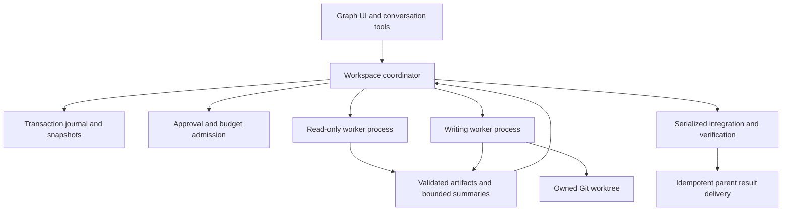

# Durable task graphs for Roo Code

Status: architecture direction approved by the user on 2026-10-01. Agent-proposed graphs with user review and editing in the UI are the primary experience. Implementation remains explicitly on hold; architecture approval does not authorize coding, builds, installation, or publication.

## 1. Scope and outcomes

Run independent agents concurrently, express dependencies between their work, and recover safely after interruption. Keep worker transcripts out of the parent conversation unless explicitly requested. Provide a graph UI for planning, observation, approvals, diagnosis, and recovery.

Initial deployment is a workspace-host coordinator with process-isolated workers. Desktop VS Code, code-server, and remote Node extension hosts are targets. Multi-machine distributed execution and guaranteed operation after the editor closes are not initial commitments.

Existing sequential subtasks remain supported and unchanged. This design does not depend on the larger Cordis-inspired refactor.

Review update (2026-10-03): implementation of this graph design remains on hold. A targeted Cordis-inspired tool-policy and approval-interface extraction has started separately; it is not the full plugin-framework refactor and does not authorize or enable graph execution. See the [first-slice implementation status and limitations](what-roo-can-borrow-from-cordis-harness.md#implementation-update-2026-10-03).

Before graph implementation, resolve the review findings: immutable execution definitions for the first release; deterministic source-tree materialization from selected predecessor artifacts; source snapshots before read-only execution; atomic parent inbox acceptance with deduplication; concrete ownership/storage mechanisms; and an early packaged-worker feasibility gate. Physical dispatch accounting and typed condensation admission outcomes remain prerequisites for the graph's budget promises. The roadmap below has not yet been revised to incorporate these decisions.

The separate refactor now includes opt-in Anthropic streaming admission and propagation of typed condensation controls without fallback truncation. This is a runtime interface, not graph budget enforcement: conservative exposure descriptors, normalized usage accounting, durable reservations, supported-provider expansion, and restricted worker bootstrap are still required. Graph execution remains unimplemented and on hold.

Preview update (2026-10-04): **Settings > Experimental > Cordis runtime preview** is now implemented for the Anthropic admission path, default off. Disabling and saving cancels active preview model requests and prevents further preview dispatch from those task instances; normal tasks remain unaffected. This is not the graph-execution setting specified below, and enabling it does not launch graphs. The [4.2.3 preview release notes](../releases/v4.2.3-cordis-preview.1.md) explain scope and rollback.

Graph execution is a user-controlled opt-in setting, off by default. When off, ordinary chat and sequential delegation remain available under their own depth/approval policy, while graph start/resume and new graph-worker admission are disabled. Disabling graphs during a run pauses new admissions and requests safe-boundary suspension; it does not imply that an in-flight request or external command was undone. Existing runs remain inspectable, with cancellation and cleanup controls available. Re-enabling the setting does not automatically resume paused work. This setting is a design requirement, not an implemented control yet.

### Success criteria

- Independent nodes actually overlap in execution under a configurable concurrency cap.
- Dependencies receive immutable, validated artifacts from explicit successful attempts.
- Wrong-worker approvals, stale completions, and duplicate deliveries cannot advance the graph.
- Budget exposure is reserved before admitted model dispatches and retained when usage is unresolved.
- Restart reconstructs committed workflow state without silently repeating uncertain external actions.
- Parallel editing never uses the user's active checkout as a shared scratch directory.
- The graph UI remains usable without loading every worker transcript.

## 2. Current constraints and reuse

| Finding | Evidence | Design consequence |
|---|---|---|
| Ordinary delegation replaces the active parent with one child | [Delegation lifecycle](../src/core/webview/ClineProvider.ts:2990) | Add a graph execution path, not repeated ordinary delegation calls |
| Child completion reconstructs one parent | [Parent resumption](../src/core/webview/ClineProvider.ts:3115) | Durable graph join and parent delivery must be separate |
| Approval replies target the current task | [Approval handler](../src/core/webview/webviewMessageHandler.ts:680) | Introduce correlated graph approvals |
| Live tasks react to provider-profile changes | [Task profile listener](../src/core/task/Task.ts:730) | Freeze execution configuration per attempt |
| Parent workspace overrides child workspace | [Task workspace selection](../src/core/task/Task.ts:523) | Workers execute independent root tasks |
| Terminals may be reassigned between tasks | [Terminal acquisition](../src/integrations/terminal/TerminalRegistry.ts:152) | Worker-scoped process ownership and cleanup |
| Browser profile cleanup can affect other sessions | [Browser profile cleanup](../src/services/browser/BrowserSession.ts:75) | Disable worker browser tools until ownership is fixed |
| Checkpoint restore resets its working directory | [Checkpoint restore](../src/services/checkpoints/ShadowCheckpointService.ts:344) | Separate worktree per writing attempt |
| Headless activation mutates process-global state | [CLI extension host](../apps/cli/src/agent/extension-host.ts:368) | One headless host per OS process |
| Noninteractive CLI policy is too permissive | [CLI approval defaults](../apps/cli/src/agent/extension-host.ts:233) | New deny-by-default worker bootstrap |
| Worktree provisioning already exists | [Worktree service](../packages/core/src/worktree/worktree-service.ts:98) | Reuse Git operations behind durable ownership records |
| Task history serializes only within an instance | [History store](../src/core/task-persistence/TaskHistoryStore.ts:538) | Separate single-writer workflow journal |
| Existing IPC lacks durable attempt fencing | [IPC contracts](../packages/types/src/ipc.ts:59) | New versioned protocol, not an unmodified transport reuse |
| Usage observations vary across providers | [Stream usage contract](../src/api/transform/stream.ts:58) | Normalize usage before accounting |

Source references describe the investigated checkout; line numbers may move during implementation.

## 3. Architecture decisions

1. **One coordinator owner per local storage root.** It alone commits graph state, accepts commands, schedules workers, manages resource reservations, and settles budgets. Additional windows forward commands to the owner or show read-only state.
2. **Process isolation first.** Reuse headless activation machinery through a dedicated packaged worker entrypoint, not the CLI terminal UI. Workers do not share extension-host globals or writable session stores.
3. **Separate workflow storage from conversation history.** A checksummed transaction journal is authoritative. Snapshots, history rows, and graph views are projections.
4. **Immutable attempts.** Each attempt pins its graph revision, prompt inputs, artifact versions, source revision, model configuration, policy, and budget envelope.
5. **DAG execution with bounded retries.** Dependencies remain acyclic. Rework is an explicit new graph revision or bounded retry, never an implicit infinite graph cycle.
6. **Central dispatch admission.** Every supported model dispatch, including retries and condensation, needs coordinator admission. Unsupported paths cannot claim strict budget enforcement.
7. **Evidence before integration.** Writers produce isolated changes and validation artifacts. A separate serialized integration node combines them and verifies the combined result.
8. **Graph UI is a client, not the scheduler.** Closing the graph tab does not stop work. Closing the host interrupts execution unless a future standalone service is configured.
9. **No new native database requirement.** Start with local-filesystem journal storage; keep the storage interface replaceable. Network/synchronized storage is unsupported for execution until durability and ownership guarantees are validated.
10. **Agent proposes, user reviews and authorizes.** Graph proposals create drafts only. The UI is the primary review and editing surface; execution requires approval of the exact validated revision. Manual authoring and templates remain supported as secondary entry points.

## 4. Logical data model

| Record | Required content |
|---|---|
| Graph definition | Schema version, revision, title, objective, node definitions, edges, input/output schemas, policies, budgets, workspace/source references |
| Graph run | Unique run ID, pinned definition revision, owner epoch, lifecycle state, parent linkage, budget ledger, resource allocations, journal revision |
| Node definition | Stable node ID, kind, purpose, mode, provider-profile reference, capabilities, dependency bindings, retry policy, limits, acceptance criteria |
| Node execution | Dependency resolution, selected attempt, scheduling priority, blocked reason, artifact references, current aggregate status |
| Attempt | Unique attempt ID, ordinal, worker incarnation, fencing epoch, source/config/input digests, start/end reason, heartbeat, dispatches and resulting artifacts |
| Artifact | ID, producing attempt, media/schema version, digest, byte size, storage reference, sensitivity, summary and evidence references |
| Approval | Unique request ID, run/node/attempt identity, exact action digest, scope, deadline, decision and decision revision |
| Resource allocation | Owned worktree, branch, process group, storage directory, repository lock or external resource claim, creation/cleanup intent |
| Accounting transaction | Reservation, physical dispatch identity, usage observation identity, price provenance, settlement/adjustment or unresolved exposure |

Node kinds: investigation, implementation, validation, review, deterministic integration, synthesis, and human gate. Node kind does not itself grant tool permission.

Definitions persist profile references and non-secret configuration fingerprints, not credentials. Resolve secrets from the existing host secret store for each authorized launch. Send them only over the private worker channel and retain them in worker memory where possible. Adapt the shim's secret-store behavior rather than writing credentials into worker session files. OAuth refresh must be centrally serialized to avoid concurrent refresh-token rotation.

A request to resume with changed credentials can preserve configuration identity; changing model, policy, inputs, or source requires a new attempt with explicit provenance.

## 5. Dependency and execution semantics

- An edge declares a predecessor outcome predicate and explicit artifact bindings. Default: all required predecessors succeeded and validated their outputs.
- Optional edges must declare the terminal outcomes they accept and a fallback value. Missing input is never silently interpreted as success.
- A join waits for every declared required predecessor. Completion order does not affect input ordering; bindings use stable node and artifact identities.
- Conditional branches use deterministic predicates over validated structured results. Unselected nodes become skipped. Branch joins explicitly accept skipped outcomes where appropriate.
- Review verdicts are structured output. A reviewer can successfully execute while rejecting a patch; a later gate determines whether integration may proceed.
- A failed required predecessor blocks descendants with a visible cause. Independent branches follow the graph's fail-fast or collect-independent policy; the default is collect-independent, then mark the overall outcome unsuccessful.
- Selection of one successful attempt is durable. A newer attempt does not silently overwrite artifacts already consumed by running descendants.
- Graph validation rejects cycles, missing bindings, incompatible schemas, unsupported capabilities, inaccessible workspace roots, and budgets that cannot admit the requested nodes.
- Ready nodes are scheduled with stable priority and FIFO aging, constrained by graph concurrency, per-provider/account concurrency, memory admission, budget reservations, and resource locks. Initial default concurrency is two, configurable after host capability checks.
- The coordinator obtains all required admission resources together or releases them; workers must not hold one lock indefinitely while waiting for another.

### Lifecycle

Run states: draft, ready, running, paused, cancelling, recovering, succeeded, failed, cancelled, or needs-attention. A paused run may retain active dispatches while they reach a safe boundary.

Node states: pending, ready, provisioning, running, waiting-approval, waiting-budget, retry-wait, succeeded, failed, blocked, skipped, cancelled, or interrupted. Blocked states carry machine-readable causes and user-readable remedies.

Attempt states distinguish prepared launch intent, launched, active, awaiting input, stopping, exited, lost, and settled. A worker's success report is provisional until artifact validation and durable commit complete. Accounting finality is separate from task completion.

### Editing and rework

- Draft graphs are freely editable and validated before start.
- Active graphs allow approved revisions affecting only unscheduled nodes. Attempts retain their pinned revision.
- Changing an upstream result creates a new revision and invalidates dependent cached results; affected running descendants must finish on the old revision or be explicitly cancelled. Never rewrite their inputs in place.
- A failed review can propose a new repair node and another review node. Automatic expansion requires a user-approved policy and an expansion cap.
- Initial reusable templates cover parallel investigation, parallel worktree implementation, and implement-test-review. Model-authored graphs are proposals subject to the same validation and approval rules as UI-authored graphs.

## 6. Durability, ownership and recovery

### Commit protocol

The single writer appends a framed, checksummed transaction with sequence, previous revision, payload length, and format version, then flushes it before acknowledgement or external dispatch. Related changes, such as admission reservation plus dispatch intent, belong to one transaction.

Write immutable artifacts first, flush and digest them, then commit references. Unreferenced artifacts can be garbage-collected later. A committed reference to a missing artifact is an integrity error, not successful output.

Snapshots are immutable generations containing their journal position and digest. Publish a flushed generation before pruning covered journal segments, retain the previous recoverable generation, and validate recovery during compaction. Do not reuse the existing JSON replacement helper as a transactional store: [current replacement behavior](../src/utils/safeWriteJson.ts:94) has different guarantees.

On startup, replay the latest verified snapshot and contiguous transactions. Recover a torn final record; quarantine interior corruption and require intervention. Disk-full or persistence errors stop dispatch and acknowledgement rather than continuing with memory-only state.

### Ownership and fencing

- Ownership uses an exclusive local lock plus an authenticated private coordinator endpoint and monotonically increasing ownership epoch.
- A stale timeout alone is not permission to take over. Confirm the previous owner cannot continue, or refuse takeover and require intervention. PID presence alone is insufficient because PIDs can be reused.
- Workers accept commands only from their launch identity and epoch; late messages from old attempts cannot mutate workflow state.
- Losing ownership or the coordinator connection makes a worker stop accepting new operations. Already dispatched provider requests may still incur usage and must remain unresolved in the ledger.
- The initial worker lifecycle is attached to the host. After coordinator restart, recover durable results and stop or positively identify surviving workers before admitting replacement attempts. Detached reconnection is a later transport capability, not an assumption.

### External-action recovery

Persist intent before process launch, worktree provisioning, integration, and cleanup. Reconcile observed state against intent after restart. Commit graph completion before parent delivery, then deliver with an idempotency key recorded by the parent-side bridge.

| Interruption | Recovery rule |
|---|---|
| Before a prepared launch occurs | Verify no worker exists, then safely launch or release admission |
| Request sent, response/usage lost | Retain unresolved exposure; do not assume the request was free |
| Worker completes before coordinator acknowledgement | Replay its persisted result with the same attempt/event identity |
| Crash during integration | Compare recorded base/result commit identities; verify an already applied change before marking success; never blindly apply twice |
| Cancellation during a command | Stop the owned process tree, preserve partial work, classify uncertain external effects |
| Crash while awaiting approval | Restore the request only if its action and attempt remain valid; otherwise expire it |
| Parent closed or switched | Store the result inbox entry; do not forcibly replace the active conversation |
| Crash during cleanup | Remove only resources positively owned by the run; retain dirty or ambiguous resources |

Delivery is at-least-once with idempotent acceptance. External side effects are not promised exactly-once execution.

## 7. Retry policy

Separate three levels: transport retry, logical model operation, and node attempt. All actual outbound dispatches have distinct accounting identities. A graph-level node retry must not multiply hidden SDK retries.

- Default node retry cap: one automatic retry for clearly transient, safely repeatable failures; configurable per node and bounded by graph limits.
- Honor provider retry hints and apply capped exponential backoff with jitter, persisted eligibility, and account-wide throttling.
- Authentication errors, invalid parameters, policy denials, missing capabilities, user rejection, test failure and review rejection are not generic transient retries.
- Unknown outcome after external effects requires reconciliation or human approval. Arbitrary commands are not retried just because their worker exited.
- Retried writing attempts get fresh owned worktrees from pinned inputs unless an explicit repair attempt consumes the prior patch. Failed worktrees remain available for inspection.
- Every retry consumes remaining graph budgets; cancellation prevents scheduled retries from firing.
- Changing model/provider as a fallback requires a declared, approved fallback policy and creates a newly identified dispatch with its own pricing.

## 8. Budgets and resource admission

Budgets can constrain total tokens, estimated money, model dispatch count, node attempts, graph expansion, wall-clock deadline, concurrent workers, and artifact/log storage. Per-node limits cannot exceed the remaining graph envelope. Approval wait consumes the graph deadline but not a worker execution deadline unless explicitly configured.

Before each chargeable dispatch, atomically reserve conservative exposure based on pinned pricing, input estimate, bounded output, and applicable cache/context/service-tier behavior. In-flight and unresolved exposure count against remaining capacity. Settlement replaces the reservation with observed usage; it does not add both amounts.

Normalize provider deltas versus cumulative snapshots before ingestion. Duplicate observation IDs are ignored. Revised usage becomes an adjustment. Retain the physical dispatch identity across reconnects, but assign a new one for each actual network retry or fallback.

Include auxiliary calls such as [condensation](../src/core/condense/index.ts:323), synthesis, and integration review. Graph-mode paths must disable hidden SDK retries or instrument their actual transport attempts before claiming strict enforcement.

Two UI-visible modes:

- **Estimated budget:** transparent estimates and reservations, with explicit unknown usage. It is not a guaranteed invoice cap.
- **Strict admission budget:** available only for fully mediated, bounded dispatch paths with supported pricing. Reject unsupported dispatches. Provider-enforced account limits remain necessary for a financial guarantee outside Roo's observability.

Subscription providers may report zero per-token price but still consume rate limits, tokens and concurrency. Zero estimated dollars must not mean unlimited work. Unknown pricing is distinct from free pricing.

When exhausted, pause new admissions and show budget intervention. Permit increasing the limit, cancelling, or revising unscheduled work. Do not silently shrink context, switch models, or discard evidence. Surface committed usage, reserved exposure and unresolved exposure separately.

## 9. Worker isolation and capabilities

Every attempt gets a canonical workspace root, dedicated writable session storage, immutable configuration, explicit environment allowlist, private IPC channel and owned process group. Disable telemetry/marketplace refresh/background indexing in worker bootstrap unless explicitly needed and authorized. No credentials in argv, graph definitions, logs, source copies or artifacts.

Read-only investigation uses a dispatcher-enforced tool allowlist. Initially disallow arbitrary commands, mutation tools, MCP, custom tools, mode/profile mutation, browser tools and nested subtasks. A consistent source snapshot is preferred to reading a changing checkout. Snapshot creation must not automatically copy ignored secrets or external symlink targets.

Writing attempts use one worktree/branch per attempt, from a recorded base commit. Dirty user changes are not silently omitted: offer an approved source snapshot of selected tracked/untracked changes, or require a clean base. Dependency installation and test commands can execute repository code and require appropriate permission. Worktrees alone do not isolate ports, services, databases, shared Git metadata, the network, or the rest of the filesystem.

**Process and worktree isolation are concurrency safeguards, not a security sandbox.** Strong untrusted-code execution requires a separate container/VM adapter with enforceable filesystem and network policy. Do not advertise hard confinement for arbitrary host shell commands.

MCP and browser access remain disabled until worker-scoped connection/session ownership and external-effect policy exist. Graph workers cannot spawn untracked children: additional work is proposed to the coordinator and admitted as graph nodes.

## 10. Integration and validation

Writers return patch/commit artifacts, source base, changed paths, tests run, test results, and known limitations. All are treated as untrusted evidence until checked by the coordinator and validator.

Integration operates in a dedicated owned worktree. Serialize operations touching shared Git metadata. Combine changes in stable dependency order; incompatible bases or overlapping changes produce a conflict state rather than choosing one worker's version.

Run validation against the actual integrated tree, not merely each branch separately. Pin the tested result commit in the review artifact. Promote into the user's checkout only after explicit approval and a clean/current-base preflight; otherwise return the branch or patch for manual application. Publishing or pushing is a separate approved action, not an implicit integration side effect.

## 11. Approval protocol and worker communication

The versioned worker protocol carries run, node, attempt, worker incarnation, owner epoch, command/event identity, sequence and acknowledgement revision. It supports handshake/capabilities, launch, heartbeat, result publication, approval requests, dispatch admission, usage observation, pause, cancellation and shutdown.

Use a private parent-child channel for initial attached workers, with logs on a separate stream. Validate payload schema and size; authenticate coordinator client sockets if used across windows. Durable command acknowledgements occur only after journal commit. Sequence gaps trigger replay or snapshot resynchronization, not guessed state.

Approvals bind to the exact proposed action digest, target resources, attempt and expiry. Display node name, model, workspace and action in one central inbox. A decision is consumed once; reject stale decisions after retry, cancellation, policy change or revision. Opening a node inspector never changes the active task to route an approval.

An approved graph is not blanket permission for every future action. Graph policy can preauthorize bounded read-only actions; writes, commands, external services, source export and promotion follow their declared approval scopes.

## 12. Context and artifact flow

- Each worker receives the objective, acceptance criteria, permitted tools, pinned source, bounded dependency summaries and explicit artifact references. It does not inherit the entire parent transcript.
- Full logs and transcripts remain in worker storage and can be opened on demand, subject to retention/access policy. The parent receives a bounded result envelope with decisions, evidence, tests, changed paths, limitations and artifact handles.
- A synthesis node combines predecessor results. Input selection is deterministic and visible; if it exceeds the configured context budget, request chunked synthesis or user-approved expansion instead of silent truncation.
- Evidence from workers is data, not authority to expand tool permissions or rewrite the coordinator's policies. Artifact paths are validated against the owned storage area and digests verified before consumption.
- Memory admission is separate from model context capacity. A model accepting a large context does not imply unlimited local RAM for several concurrent transcripts, snapshots and renderers.

## 13. Graph UI

Add a lazy-loaded graph tab next to history/settings using the [existing App routing](../webview-ui/src/App.tsx:26). Use React Flow and Dagre as explicit proposed dependencies, subject to license, accessibility, bundle-size and VS Code CSP validation. Mermaid remains useful for documentation, not execution editing. Provide an equivalent keyboard-accessible list/table view.

### Primary experience: agent-proposed graph review

1. The user describes an objective in the conversation. The planning agent proposes a structured draft graph with node responsibilities, dependency rationale, expected artifacts, acceptance criteria, capabilities, model/profile choices, retry limits and budget assumptions.
2. The coordinator validates and persists the proposal without launching workers or provisioning worktrees. Invalid proposals return actionable validation feedback. Planning-model calls remain subject to the parent task's existing approvals and usage accounting; draft-only does not mean planning itself is free.
3. A conversation card opens the draft in the graph UI. The review screen summarizes parallel branches, integration gates, requested permissions, source baseline and cost uncertainty. It makes unsupported capabilities and missing budgets explicit.
4. The user edits nodes, dependencies, limits, models and permissions, or asks the agent to revise the proposal. Agent revisions are presented as a diff against a specified draft revision and cannot silently overwrite user edits. Stale revisions are rejected or explicitly reconciled.
5. Approve and start validates the latest revision and host capabilities again, then durably records approval bound to the graph's execution-relevant digest before admission. Semantic changes invalidate prior start approval; canvas layout changes do not. Replayed start commands cannot create duplicate runs.
6. During execution, material replanning returns to the same proposal-and-review flow. Start approval does not authorize unrestricted graph expansion, increased budgets, broader capabilities or automatic publishing.

The first user-facing execution release must include this review/edit/start loop. A mature canvas editor may follow a minimal structured review form and accessible node list, but execution must not ship ahead of the review gate.

### Main surfaces

- **Run list:** status, objective, workspace, source revision, progress, estimated usage, last update and recovery indicator.
- **Canvas:** dependency edges, accessible node status labels, blocked reasons, approval markers, active attempt and retry count. Stable layout during streaming; status is not communicated only by color.
- **Node inspector:** objective, bindings, input/source digests, mode/model, capabilities, limits, attempt timeline, output artifacts, diffs, validation and bounded log tail. Full transcript opens read-only.
- **Approval inbox:** filter by run, inspect exact action, approve/reject with clear scope, display stale/expired requests.
- **Budget panel:** committed/reserved/unresolved usage, provider rate-limit state, remaining tokens/requests and explicit increase-limit action.
- **Recovery panel:** interrupted attempts, uncertain effects, preserved worktrees and proposed safe recovery actions.

### Controls

Draft: add node, connect dependencies, edit bindings, choose templates, validate, preview cost/capabilities, approve start.

Running: pause admissions, resume, cancel node/run, inspect workers, approve actions, revise unscheduled nodes. Force-stop is distinct from graceful pause and warns about partial writes and unresolved usage.

Terminal: retry eligible nodes, fork a revised run, export a redacted definition/result manifest, inspect or clean owned worktrees, and archive/delete through confirmed retention rules.

Graph state travels through revisioned graph-specific snapshots/deltas, not frequent full extension-state broadcasts. Virtualize logs/timelines, batch progress events, cap client retention and resync on revision gaps. Persist layout separately from execution state so moving a node cannot reschedule it.

## 14. Deployment and component boundaries

Proposed new boundaries, with final names settled at implementation review:

- A host-independent workflow core: schema validation, state reducer, scheduling, dependency resolution, retry policy and accounting rules.
- A workspace coordinator service: journal ownership, worker lifecycle, approvals, artifact verification, source/worktree ownership and parent delivery.
- A dedicated headless worker bundle: extension activation through a restricted shim, frozen settings, tool capability enforcement and instrumented model dispatch.
- Typed graph messages and a graph-specific webview client/view.

The [extension build](../src/esbuild.mjs:117) needs a worker entrypoint and explicit asset/dependency closure. Packaging must work from an extracted VSIX without repository dependencies or a globally installed CLI. Validate required WASM, locales, ripgrep and dynamic dependencies. Use actual host application paths, not assumptions inherited from the CLI install layout.

Probe a supported Node launch route on each target host. Try the validated host executable with appropriate Node/Electron configuration, then an explicitly configured Node executable. Do not silently download executables. Unsupported runtime means execution unavailable with a diagnostic, not fallback to unsafe in-process concurrency.

Workers always launch on the workspace machine. Genuine browser-only hosts are unsupported by the current Node extension; future graph inspection can be separated from execution. A standalone persistent coordinator is a later deployment adapter requiring authenticated transport and service lifecycle management.

## 15. Phased implementation roadmap

Each phase is independently reviewable. Execution remains behind a feature flag until its acceptance gate passes. These are implementation instructions for a later approved task, not work performed now.

- [ ] P0: Define schemas, agent proposal/revision contracts, lifecycle transitions, artifact contracts and a pure deterministic scheduler with a fake worker adapter. Gate: draft proposals never dispatch work; diamond graphs, cycle rejection, branches, joins, blocked dependencies, immutable revisions and single selected attempt pass unit tests.
- [ ] P1: Implement single-writer journal, snapshots, ownership and recovery. Gate: crash injection at every commit/publication boundary, torn tails, interior corruption, disk-full and competing coordinators never produce double ownership or acknowledged lost state within the supported filesystem envelope.
- [ ] P2: Package the restricted headless worker and versioned private protocol. Gate: extracted VSIX runs workers on Windows, macOS, Linux, code-server and a remote host, with independent cwd/storage/config and no repository dependency assumptions.
- [ ] P3: Implement correlated approvals and centrally admitted accounting-aware dispatch, including retries and auxiliary calls. Gate: stale approvals rejected, duplicate usage deduplicated, distinct retries charged, unknown usage retained, strict mode rejects unsupported paths.
- [ ] P4: Connect agent draft proposals, a minimum UI review/edit/start gate, read-only graph execution and fan-in to the existing parent conversation. Gate: only the exact approved revision launches; two investigations overlap, respect capability restrictions, survive reversed completion order, and deliver a durable result exactly once at the parent acceptance layer.
- [ ] P5: Add owned source snapshots, attempt worktrees, serialized integration and validation gates. Gate: conflicts stop integration, dirty-base decisions are explicit, checkpoints cannot affect siblings, and a crash during promotion is reconciled without duplicate application.
- [ ] P6: Expand the minimum graph review UI into the full canvas, accessible list view, agent revision diffs, node inspector, approvals, budgets and recovery controls. Gate: agent revisions preserve user edits; UI reconnects via revisions, does not switch active tasks on inspection, preserves unsaved settings and stays responsive with bounded logs on large graphs.
- [ ] P7: Add approved live revisions, templates, bounded rework expansion, redacted import/export, retention and diagnostic bundles. Gate: revised upstream inputs invalidate downstream reuse correctly, exports contain no credentials, and cleanup never deletes unowned or uncertain work.
- [ ] P8: Run full failure/compatibility acceptance, update user documentation, and enable an opt-in preview release. Gate: sequential delegation remains unchanged and runtime capability diagnostics are actionable.

UI mockups can be reviewed alongside P0, and the client can develop against fake graph events before P6. Shipping real execution must still wait for the durability, approval and accounting gates.

## 16. Required adversarial and regression tests

- Sequential/nested delegation regression using [existing delegation tests](../src/__tests__/provider-delegation.spec.ts:98).
- Draft creation cannot launch workers; stale agent revisions cannot overwrite user edits; semantic changes invalidate start approval; duplicate start delivery cannot launch a second run.
- Cross-worker profile mutations, approval misrouting, duplicate/stale results, reversed completions and cancellation while awaiting approval.
- Duplicate transport observations versus genuine retry dispatches; late usage after cancellation; zero-price subscriptions and unknown-priced models.
- Worker/coordinator crashes before and after each external-effect boundary, including Git provisioning, integration, artifact publication and parent delivery.
- Path traversal, symlink escape in read tools, forged artifact references, oversized protocol frames and attempted tool-policy escalation.
- Process-tree cleanup, leaked children, memory pressure, concurrent source mutations and shared external-resource conflicts.
- Windows rename/flush semantics, supported filesystem restart recovery, and explicit rejection of unsupported storage roots.
- Graph UI keyboard use, contrast/status labels, high-node-count navigation, event-gap recovery and transcript retention limits.

## 17. Proposed defaults and review points

Proposed defaults: two concurrent workers; read-only investigation as the initial enabled template; per-attempt worktrees for writing; collect independent branches after failure; one automatic node retry for safe transient failures; explicit approval for integration into the user's checkout; no automatic publishing; no untracked nested workers; estimated budgets unless strict admission support is proven.

User-specific dollar/token caps and provider concurrency limits remain configurable rather than invented. The initial system pauses at unresolved recovery decisions instead of maximizing throughput at the expense of correctness.

Approved product direction: prioritize agent-proposed graphs that the user reviews and edits in the UI. Architecture direction is approved; implementation remains on hold until separately authorized.

Remaining review choices: whether workspace-host lifetime is sufficient before a standalone service, and whether container-enforced untrusted-code execution is needed for the first writing release. Neither blocks the approved agent-proposal workflow.

Only this design document was created. No application code, runtime configuration, build artifact, Git release or installed extension was changed for this design task.
