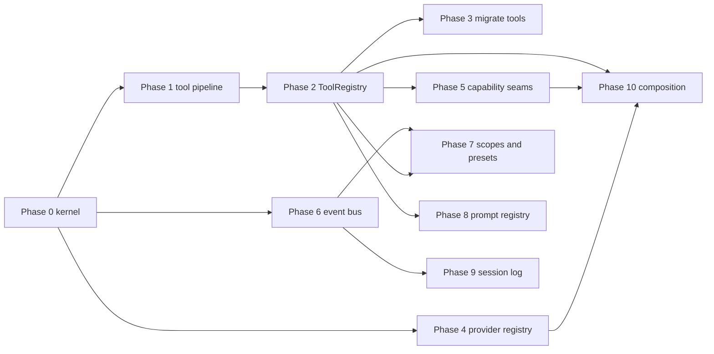

# What Roo-Code can borrow from the Cordis "everything is a plugin" harness

## Purpose

Roo-Code and DeepSeek Harness (`dsh`) are both coding agents, but they sit at opposite ends of an extensibility spectrum. `dsh` is built on Cordis, where every part of the product is a plugin composed from configuration. Roo-Code is a monolithic VS Code extension where tools, providers, and state are hardcoded and dispatched from a large switch.

This document maps the harness patterns onto Roo-Code, identifies which are worth adopting, and proposes an incremental path. The private-infra work is tracked separately in [`private-infra-dsh-and-roo-code-plan.md`](private-infra-dsh-and-roo-code-plan.md).

## Part 1 - How the harness is built

The harness rests on five Cordis ideas ([`cordis-primer.md`](../../deepseek-harness/docs/cordis-primer.md:7)):

1. A plugin is an object implementing a service, mounted into a context.
2. A context is a repository of services keyed by `ctx.<key>`; consumers find services by key, never by importing a concrete implementation.
3. Dependencies are declared with `inject`, so load order falls out of service requirements rather than manual boot sequencing.
4. Communication is typed events with five dispatch modes: `emit`, `waterfall`, `parallel`, `serial`, `bail`.
5. Registrations are reversible effects, so reload and teardown unwind predictably.

There is no privileged core: the model adapter, tool registry, session log, and even the agent loop are plugins ([`architecture.md`](../../deepseek-harness/docs/architecture.md:11)).

### Capability seams

A seam is a swappable capability with three roles: a Service Definition (owns the `ctx.<key>` and vocabulary types), one or more Service Providers, and one or more Consumers ([`glossary.md`](../../deepseek-harness/docs/glossary.md:7)). Filesystem and subprocess are separate seams that share one execution world, so pointing them at a remote sandbox moves Bash, PTY, and LSP with them ([`architecture.md`](../../deepseek-harness/docs/architecture.md:129)). Seams in the product include `ctx.fs`, `ctx.shell`, `ctx.subprocess`, `ctx.sandbox`, `ctx.web`, `ctx.llm`, `ctx.tools`, `ctx.approval`, `ctx.storage`, `ctx.credentials`, `ctx.settings`, `ctx.sessionTelemetry`, `ctx.sessionPersistence`, and `ctx.sessionProjections`.

### Events as the extension surface

Events live in three domains ([`architecture.md`](../../deepseek-harness/docs/architecture.md:70)):

- Session events are durable facts appended to the log and broadcast through `session/event`.
- Agent events (`agent/*`) carry a live agent and observe or intercept work in flight.
- Capability events (`fs/*`, `tools/*`, `telemetry/*`) attach policy and adapters to a seam without importing the loop.

Waterfalls are around-middleware: a listener receives `(...args, next)`, calls `next()` to delegate, or returns without it to short-circuit ([`cordis-primer.md`](../../deepseek-harness/docs/cordis-primer.md:29)).

### The tool execution pipeline

This is the clearest single pattern to borrow ([`tool-execution-pipeline.md`](../../deepseek-harness/docs/tool-execution-pipeline.md:6)):

```text
tool/call (logged)
  -> presentCall (UI pending card)
  -> tools/pre-execute (waterfall: hooks, permission, sandbox)
  -> monotonic guards (ctx.tools.guard; deny or abstain, cannot be undone)
  -> ctx.approval (one-shot prompt; absent or unanswerable means deny)
  -> tools/execute (around dispatch: timeout, retry, metrics)
  -> tool body execute()
  -> fs/write-intent or fs/edit-intent (filesystem mutations only)
  -> tools/post-execute (waterfall: accept, block, replace, add context)
  -> normalization (throws become isError)
  -> finalizeContent (content-only invariant)
  -> tools/result (frozen authoritative outcome)
  -> presentResult (UI completed card)
```

Tools are registered with `defineTool`, which validates model arguments against a schema, snapshots the return value as lossless JSON, and renders model-facing content separately from UI presentation ([`adding-a-tool.md`](../../deepseek-harness/docs/cookbook/adding-a-tool.md:9)). Presentation projections (`presentCall`/`presentResult`) are pure functions so they replay from the log. PTC mode exposes every registered tool as `tools.<name>(args)` that re-enters the same pipeline.

### Session log and projections

The session log is an append-only stream of typed events, and everything else derives from it: model history via `deriveMessages()`, fork, resume, transcripts, telemetry, and persistence ([`architecture.md`](../../deepseek-harness/docs/architecture.md:117)). The governing invariant is "model-visible means logged": anything that reaches a model request must be reconstructable from the log ([`architecture.md`](../../deepseek-harness/docs/architecture.md:121)). The projection seam folds committed events into typed client state, which is how the UI gets incrementality without reading raw events ([`architecture.md`](../../deepseek-harness/docs/architecture.md:123)).

### Composition and agent scopes

A running harness is a plugin tree composed from ordered layers: bundle layers, then the profile `cordis.patch.yml`, then the home-level patch, then `--patch` overlays. A patch targets a row by id and replaces its whole config, or inserts new rows ([`architecture.md`](../../deepseek-harness/docs/architecture.md:27)). Agent scopes give per-agent registration: contributions are either global or scoped to one agent, with most-specific-wins shadowing and restrictions that intersect the global tool set ([`glossary.md`](../../deepseek-harness/docs/glossary.md:11)). Agent presets compose a per-session tree from a `cordis.yml`.

## Part 2 - What Roo-Code has today

| Concern | Roo-Code today | Evidence |
|---|---|---|
| Orchestration | One `Task` class, roughly 4,800 lines, `EventEmitter<TaskEvents>` | [`Task.ts`](../src/core/task/Task.ts:213) |
| Tool dispatch | Central switch in `presentAssistantMessage`, calling hardcoded tool classes | [`presentAssistantMessage.ts`](../src/core/assistant-message/presentAssistantMessage.ts:721) |
| Tool contract | Abstract `BaseTool<TName>` with `execute(params, task, callbacks)` | [`BaseTool.ts`](../src/core/tools/BaseTool.ts:29) |
| Tool identity | Static `ToolName` union in `@roo-code/types` | [`validateToolUse.ts`](../src/core/tools/validateToolUse.ts:2) |
| Conditional tools | Experiment-gated loading from `.roo/tools` directories via esbuild | [`custom-tool-registry.ts`](../packages/core/src/custom-tools/custom-tool-registry.ts:31), [`build-tools.ts`](../src/core/task/build-tools.ts:200) |
| Providers | `buildApiHandler` switch over provider name, one handler class each | [`index.ts`](../src/api/index.ts:111) |
| External extension | MCP servers, custom modes, custom instructions, skills, slash commands | [`McpHub`](../src/services/mcp), `.roo/` |
| Events | Ad hoc `EventEmitter` per class, no middleware semantics | [`Task.ts`](../src/core/task/Task.ts:213), [`ClineProvider.ts`](../src/core/webview/ClineProvider.ts:114) |
| State | Message JSON per task plus git-based checkpoints, coupled to tasks | [`checkpoints/index.ts`](../src/core/checkpoints/index.ts:211) |

The important observation: Roo-Code already has the seedling of a plugin system in [`customToolRegistry`](../packages/core/src/custom-tools/custom-tool-registry.ts:432), but it is bolted onto the side behind an experiment flag rather than being the way all tools work.

## Part 3 - What to borrow, ranked

### Tier 1 - high value, contained risk

1. Tool execution waterfalls and guards. Replace the hardcoded dispatch and inline approval checks with three events modelling `tools/pre-execute`, `tools/execute`, and `tools/post-execute`, plus a monotonic guard registry. The first listeners should be the existing auto-approval logic ([`src/core/auto-approval/index.ts`](../src/core/auto-approval/index.ts)), mode-based tool restrictions, and command denylisting. This removes the largest source of coupling in [`presentAssistantMessage.ts`](../src/core/assistant-message/presentAssistantMessage.ts:721) without changing user-visible behavior.

2. A real tool registry seam. Evolve `customToolRegistry` into a first-class `ToolRegistry` service, and register the built-in tools through it instead of through a switch. Adopt the `defineTool` contract shape: schema-driven argument validation, a canonical JSON return value, model-facing render, and separate pure UI presenters. This is the change that makes tools genuinely addable and removable at runtime.

3. Capability seams for the execution environment. Extract filesystem, shell/terminal, subprocess, browser, and sandbox behind Service Definition interfaces. Roo-Code already isolates browser and code-index into services ([`src/services`](../src/services)); formalizing them as seams is what would let a remote or sandboxed execution world swap in, matching how `dsh` moves Bash, PTY, and LSP together.

4. A provider registry. Replace the `buildApiHandler` switch with adapters registered on a service, and describe routes with declarative profiles. This pairs directly with the private-infra goal, since a local gateway becomes one more registered route rather than a special case.

### Tier 2 - high value, medium risk

5. A typed event bus with dispatch modes. Roo-Code uses `EventEmitter` per class. A shared bus with `waterfall` semantics is what makes around-middleware possible for requests, tools, and turns, and it is the substrate the tool pipeline needs.

6. Reversible registrations. Make dynamic tool and plugin registration effect-based so disposing a plugin unregisters cleanly. The stale-reload logic in [`customToolRegistry`](../packages/core/src/custom-tools/custom-tool-registry.ts:139) is a manual approximation of this.

7. Scoped composition. Generalize modes into global versus per-task scoped registrations with shadowing and restriction-as-intersection. This is a better fit for subagents and per-task capability sets than the current mode string, and it maps naturally onto Roo-Code's existing modes and presets.

8. Prompt assembly registry. Let a registered tool contribute its schema and prompt sections automatically, the way `dsh` schema assembly does. Today tool schemas and prompt sections are assembled in bespoke code.

### Tier 3 - high value, longer horizon

9. Event-sourced session log with projections and migrations. This is the deepest change and the most valuable long term: it enables deterministic replay, fork and resume, derived telemetry, auditability, and a clean separation between durable fact and UI incrementality. It should be introduced incrementally as a new typed event layer alongside the current message JSON, with projections feeding the webview. The "model-visible means logged" invariant should be adopted as a documented rule even before the storage changes.

10. Declarative composition with profiles and bundles. Roo-Code now has more than one host (`src/`, `apps/cli`, `apps/web-evals`), so a shared composition layer with named bundles and ordered, id-targeted patch layers would let distribution-specific trees (extension, CLI, cloud) be assembled rather than forked. Expose it as an advanced surface analogous to `.roomodes`, keeping the settings UI as the primary path.

11. Runtime invariants registry, human command registry, configuration schema to generated catalog, and fail-loud misconfiguration. These are smaller, self-contained borrowings that improve correctness and documentation.

## Part 4 - Recommended first slice

Do not attempt the session log or profiles first. Build a minimal kernel and migrate one vertical end to end:

1. Add a small kernel package (for example `packages/core/src/kernel`) providing `Context`, a `Service` base, `inject`, typed events with the five dispatch modes, and effect-based disposal.
2. Introduce `ToolRegistry` and `defineTool` on top of it.
3. Implement the three tool waterfalls plus the guard and approval stages.
4. Migrate a handful of representative tools: `read_file`, `write_to_file`, `execute_command`, `ask_followup_question`, `update_todo_list`.
5. Move auto-approval and mode-based restrictions into pipeline listeners.
6. Keep the existing dispatch as a fallback behind a flag, following the `customTools` experiment precedent ([`build-tools.ts`](../src/core/task/build-tools.ts:200)).
7. Cover it with tests per the repository test policy.

Only after that vertical proves out should the provider registry, seams, and eventually the session log be tackled.

## Part 5 - What not to copy

- Vendoring Cordis or adopting everything-is-a-plugin literally. Treating the agent loop as a replaceable plugin is elegant, but Roo-Code's loop is entangled with the VS Code host and webview. A staged extraction is safer.
- The loader's `!!js` config evaluation and id-targeted patch semantics for end users. It is powerful but adds a security and complexity surface that conflicts with Roo-Code's schema-and-settings-UI model. Keep composition as an internal or advanced surface.
- Per-session isolate realms. Not needed until per-session service rows exist.
- YAML profiles as the primary configuration experience. Roo-Code users expect the settings UI.

## Part 6 - Concept mapping

| Harness concept | Roo-Code home | Payoff |
|---|---|---|
| `ctx.tools` registry + `defineTool` | replaces `BaseTool` + dispatch switch | runtime-addable tools, uniform validation |
| `tools/pre-execute` / `execute` / `post-execute` | replaces inline checks in `presentAssistantMessage` | policy, approval, sandbox as listeners |
| `ctx.tools.guard` | new monotonic guard registry | non-bypassable policy |
| `ctx.llm` adapter registry | replaces `buildApiHandler` switch | declarative provider routes, local gateways |
| Capability seams (`fs`, `shell`, `subprocess`, `sandbox`) | formalizes `src/services/*` | swappable execution world |
| Typed events with dispatch modes | new shared event bus | around-middleware, interception |
| Effect-based registrations | lifecycle for custom tools/plugins | clean reload and teardown |
| Agent scopes and presets | generalizes modes | per-task capability sets, subagents |
| Prompt assembly registry | replaces bespoke assembly | tools bring their own schema and sections |
| Session log + projections | long-term replacement for task JSON | replay, fork, resume, audit |
| Profiles and bundles | shared composition across hosts | one tree per distribution |
| Runtime invariants | new registry | enforce owned relationships |

## Part 7 - Phased roadmap

Sizing note: sizes below are relative complexity (XS, S, M, L, XL) describing scope, coupling, and number of moving parts. They are deliberately not time estimates. Risk is rated by likelihood and impact together, with the reason stated so the rating can be challenged.

Every phase must be independently shippable, feature-flagged, and revertible. No phase may leave the product in a state where the old and new paths both execute for the same call.

### Phase 0 - Kernel foundations

- Goal: introduce a plugin kernel beside the existing code with zero behavior change.
- Scope: `Context`, `Service` base, `inject` dependency declaration, typed event bus with the five dispatch modes, effect-based disposal. No consumers yet.
- Depends on: nothing.
- Size: M (a new isolated package).
- Risk: Low. Nothing in the running product imports it yet.
- Blast radius: none until Phase 1.
- Exit criteria: unit tests cover each dispatch mode, dependency gating via `inject`, and disposal unwinding; the package is not referenced by `Task` or any tool.
- Rollback: delete the package.

### Phase 1 - Tool execution pipeline

- Goal: move tool policy, approval, and result handling into waterfalls with no user-visible change.
- Scope: `tools/pre-execute`, `tools/execute`, `tools/post-execute` events; a monotonic guard registry; an approval adapter over the existing `askApproval`; a pass-through wiring into [`presentAssistantMessage.ts`](../src/core/assistant-message/presentAssistantMessage.ts:721); auto-approval ([`src/core/auto-approval/index.ts`](../src/core/auto-approval/index.ts)) and mode restrictions reimplemented as listeners.
- Depends on: Phase 0.
- Size: L (the central dispatch path, roughly 40 tools).
- Risk: High. Every tool call flows through this, and a regression is user-visible.
- Blast radius: all tools, all modes.
- Mitigations: land as pass-through with no-op listeners first; keep the legacy switch as the fallback behind the flag; compare old versus new outcomes on a recorded task corpus; approvals modeled as a seam so a missing promise resolves to deny, matching the harness rule.
- Exit criteria: auto-approval and restriction outcomes identical in tests; tool results byte-identical on the replay corpus; flag toggles cleanly in both directions.
- Rollback: disable the flag.

### Phase 2 - ToolRegistry and defineTool

- Goal: make one registry the source of truth for tool definitions.
- Scope: `ToolRegistry` service; `defineTool` with schema-validated arguments, a canonical JSON return value, a model-facing render, and pure UI presenters; built-in tools registered through it; [`customToolRegistry`](../packages/core/src/custom-tools/custom-tool-registry.ts:432) folded in as one loader rather than a parallel system.
- Depends on: Phase 0, Phase 1.
- Size: L.
- Risk: Medium to High. Tool definitions currently feed prompt assembly, [`NativeToolCallParser`](../src/core/assistant-message/NativeToolCallParser.ts), [`validateToolUse.ts`](../src/core/tools/validateToolUse.ts), and [`build-tools.ts`](../src/core/task/build-tools.ts), so all four must agree during migration.
- Blast radius: tool schemas in the prompt, native tool-call parsing, custom tool loading.
- Mitigations: register built-ins incrementally with a compatibility shim exposing the old `ToolName` union; assert prompt parity in snapshots; keep custom tools on the same contract.
- Exit criteria: prompt tool list is equivalent to today; no second dispatch path; built-in and custom tools share one contract.
- Rollback: flag back to the static registry.

### Phase 3 - Migrate representative tools

- Goal: prove the contract on real tools before broad migration.
- Scope: `read_file`, `write_to_file`, `execute_command`, `ask_followup_question`, `update_todo_list`, then batch the remainder by family.
- Depends on: Phase 2.
- Size: M for the first five, M per family batch thereafter.
- Risk: Medium. Individual tools are well tested, but `execute_command` interacts with terminals and approvals.
- Blast radius: only the migrated tools.
- Exit criteria: parity tests per tool; legacy classes deleted for migrated tools; no dual code paths.
- Rollback: revert per tool since each is an isolated registration.

### Phase 4 - Provider registry

- Goal: replace the [`buildApiHandler`](../src/api/index.ts:111) switch with registered adapters and declarative route profiles.
- Scope: an adapter registry service; per-provider registration; route profiles carrying base URL, credential reference, model catalog, and capability flags.
- Depends on: Phase 0.
- Size: M to L.
- Risk: Medium. Provider behavior is broad but well isolated per handler, and settings schema changes can break stored configuration.
- Blast radius: provider selection, settings migration, model catalog.
- Mitigations: keep the switch as a fallback until every provider registers; add a settings migration test; this phase is the natural home for the local and LiteLLM routes from the private-infra plan.
- Exit criteria: every provider registers; a local OpenAI-compatible route is declarative; the switch is deleted.
- Rollback: flag back to the switch.

### Phase 5 - Capability seams for the execution environment

- Goal: extract filesystem, shell and subprocess, browser, and sandbox behind Service Definition interfaces with a local provider each.
- Scope: split the full set into independent seams; migrate consumers to inject the seam rather than import a concrete implementation.
- Depends on: Phase 0, benefits from Phase 2.
- Size: XL for the full set; S to M per seam.
- Risk: High for filesystem and shell (core behavior, approvals, sandboxing), Medium for browser and code-index.
- Blast radius: file reads and writes, command execution, checkpoints, indexing.
- Mitigations: one seam per change, local provider first, no behavior change allowed in the extraction, heavy use of existing specs in [`src/services`](../src/services).
- Exit criteria: each seam has a local provider and migrated consumers; a second provider is demonstrably swappable.
- Rollback: per seam.

### Phase 6 - Shared typed event bus

- Goal: adopt the kernel bus across `Task` and `ClineProvider` instead of ad hoc `EventEmitter` instances.
- Depends on: Phase 0.
- Size: M.
- Risk: Medium. Event ordering is load-bearing for the webview.
- Exit criteria: task lifecycle events delivered through the bus with parity; no remaining ad hoc emitters on the hot path.
- Rollback: dual-emit then remove.

### Phase 7 - Scoped composition and presets

- Goal: generalize modes into global versus per-task scoped registrations with shadowing and restriction-as-intersection, plus per-task presets.
- Depends on: Phase 2, Phase 6.
- Size: L.
- Risk: Medium to High, because it changes mode semantics that users depend on.
- Blast radius: modes, tool availability, subagents.
- Mitigations: express current modes as presets and assert behavioral parity before adding new capability; keep the mode string as the user-facing name.
- Exit criteria: existing modes reproduced exactly by presets; per-task capability sets available.
- Rollback: keep the mode-to-preset mapping reversible.

### Phase 8 - Prompt assembly registry

- Goal: tools contribute their schema and prompt sections through registration.
- Depends on: Phase 2.
- Size: M.
- Risk: Medium, since prompt composition affects model behavior.
- Exit criteria: schema and section assembly driven by registrations; snapshot parity with current prompts.
- Rollback: flag back to bespoke assembly.

### Phase 9 - Event-sourced session layer, incremental

- Goal: introduce typed durable events alongside the current message JSON, then derive model history and UI state from them.
- Scope, as sub-phases: 9a dual-write a typed event log beside task messages; 9b projections feeding the webview read path; 9c derive model history from the log; 9d versioned migrations and fork and resume.
- Depends on: Phase 0, Phase 6.
- Size: XL overall; each sub-phase is L to XL.
- Risk: Very High. It touches persistence, task history, checkpoints, webview state, and resume, and a mistake corrupts user history.
- Blast radius: all persisted state.
- Mitigations: never rewrite the existing format in place; dual-write first with the old format still authoritative; adopt the model-visible-means-logged invariant as a documented rule before the storage change; make each sub-phase independently revertible; build replay tests from recorded sessions.
- Exit criteria, per sub-phase: 9a the log is complete and never authoritative; 9b the webview reads projections with parity; 9c a feature flag derives history from the log; 9d migrations are versioned and fork and resume pass replay tests.
- Rollback: flag off and fall back to message JSON, which remains intact throughout.

### Phase 10 - Declarative composition across hosts

- Goal: assemble distribution-specific trees (extension, CLI, web-evals) from named bundles and ordered, id-targeted patch layers instead of forking.
- Depends on: Phase 0, and the registrable surfaces from Phases 2, 4, and 5.
- Size: L.
- Risk: Medium. Composition errors are load-time failures, which are recoverable, but the surface is new.
- Exit criteria: the three hosts share one composition; each distribution is a bundle set; misconfiguration fails loud at startup.
- Rollback: hosts keep their hardcoded bootstrap until parity is proven.

### Dependency graph



## Part 8 - Risk register

| Risk | Phase | Likelihood | Impact | Mitigation | Detection |
|---|---|---|---|---|---|
| Tool behavior regression during pipeline migration | 1, 3 | High | High | pass-through first, replay corpus comparison, flag fallback | golden outcome tests |
| Prompt divergence after registry migration | 2, 8 | Medium | High | snapshot the assembled prompt before and after | prompt snapshot tests |
| Stored settings break on provider changes | 4 | Medium | Medium | settings migration and defaults test | migration unit tests |
| Filesystem or shell seam changes behavior or permissions | 5 | Medium | High | extract with no behavior change, local provider first | filesystem and permission specs |
| Webview event ordering changes | 6 | Medium | High | dual-emit during migration | webview integration tests |
| Mode semantics drift under presets | 7 | Medium | Medium | reproduce current modes exactly first | mode parity tests |
| Persisted task history corruption | 9 | Low | Very High | dual-write, old format stays authoritative, never rewrite in place | replay tests from recorded sessions |
| Kernel grows into a framework with no adopters | 0 | Medium | Medium | gate every phase on an adopter; timebox the kernel to what Phase 1 needs | lack of consumers in review |

## Part 9 - Sequencing rules and decision gates

1. Phases 0 and 1 are one decision gate: if the pipeline cannot be made a pure pass-through with parity, stop and reconsider before building the registry.
2. Phase 2 is a gate for Phases 5, 7, 8, and 10, because all of them assume tools are registrations.
3. Phase 9 must not start before Phase 6, and 9a must ship and soak before 9b begins.
4. No phase may add a second execution path for a call that the first path already handles. Temporary dual paths are allowed only for event emission during migration, and must be removed within the same phase.
5. Each phase needs an owning adopter before it starts. The kernel exists to serve a phase, not the reverse.
6. The private-infra requirements from [`private-infra-dsh-and-roo-code-plan.md`](private-infra-dsh-and-roo-code-plan.md) are satisfied independently and should not be used as justification to accelerate Phases 5 or 10.

## Part 10 - Resolved decisions

Recorded after inspecting the repository. Each decision states the finding, the decision, and the consequence.

### D1 - The kernel lives in a new `packages/kernel` workspace

- Finding: the workspace globs are `src`, `webview-ui`, `apps/*`, and `packages/*` ([`pnpm-workspace.yaml`](../pnpm-workspace.yaml:1)). Turbo builds with `dependsOn: ["^build"]` and per-package `dist/**` outputs ([`turbo.json`](../turbo.json:13)), so a new package is ordered automatically. [`packages/core`](../packages/core) already exposes environment-split entry points (`browser.ts`, `cli.ts`), showing multi-environment consumption is an established pattern.
- Decision: create `packages/kernel` publishing `@roo-code/kernel`. It is isomorphic: no Node built-ins, no `vscode` import, no `@roo-code/core` dependency. It is consumed by `src` and, where relevant, `webview-ui`.
- Rationale: keeps the kernel out of the extension-only dependency graph, prevents it accreting `Task` or `ClineProvider` coupling, and avoids dragging the Node dependencies in [`@roo-code/core`](../packages/core) (fs, execa) into browser consumers.
- Consequence: Phase 0 adds a workspace package with a `build` script and tsconfig references. No consumer is required until Phase 1.

### D2 - `ToolName` stays a compile-time union; plugin tools get a separate runtime space

- Finding: `ToolName` is `z.infer<typeof toolNamesSchema>`, derived from the `toolNames` array ([`tool.ts`](../packages/types/src/tool.ts:17)). It drives exhaustive typing across `NativeToolArgs`, `ToolUse<TName>`, and the dispatch switch, and [`validateToolUse.ts`](../src/core/tools/validateToolUse.ts:2) already treats registry tools as an additive set.
- Decision: keep `toolNames` and the derived `ToolName` union as the compile-time contract for built-in tools. Add a separate, runtime-extensible plugin tool name space that the registry owns and merges for prompt assembly and parsing, validated by registry membership exactly as [`NativeToolCallParser`](../src/core/assistant-message/NativeToolCallParser.ts:774) and [`validateToolUse.ts`](../src/core/tools/validateToolUse.ts:20) already do for `customToolRegistry`.
- Rationale: making `ToolName` purely registry-derived would widen it to `string` at dozens of call sites and forfeit exhaustiveness, a large refactor with little payoff.
- Consequence: Phase 2 keeps the [`packages/types`](../packages/types) API stable. The registry becomes the runtime source of truth while the compile-time union still enumerates built-ins, and the existing `customTools` membership checks remain the model for plugin tools.

### D3 - Model-facing schemas must be byte-identical during migration

- Finding: built-in schemas are static, produced by `getNativeTools({ supportsImages })` in [`native-tools`](../src/core/prompts/tools/native-tools), filtered by [`filter-tools-for-mode`](../src/core/prompts/tools/filter-tools-for-mode.ts), and assembled in [`build-tools.ts`](../src/core/task/build-tools.ts:115). Custom tool schemas pass through [`formatNative`](../packages/core/src/custom-tools/format-native.ts), which is already snapshot-tested ([`format-native.spec.ts`](../packages/core/src/custom-tools/__tests__/format-native.spec.ts:216)).
- Decision: during Phases 2 and 3 the emitted JSON Schema must match today byte for byte, enforced by snapshots over the assembled tool array and per-tool `formatNative` output. Any intentional schema change is a separate, versioned change made after migration completes.
- Rationale: schema drift changes model behavior and is hard to attribute during a large refactor, whereas snapshots make parity mechanical.
- Consequence: `defineTool` may be richer internally but must emit the identical schema for built-ins. Add an assembled-tool-array snapshot test in Phase 2 if one does not already exist.

### D4 - The parity corpus is created in-repo, not sourced from evals

- Finding: the evals system is a distributed platform (Postgres, Redis, controller, Docker runners) whose exercises live in the external `Roo-Code-Evals` repository, per the evals context. No committed recorded task sessions exist: searches for `apiConversationHistory` and `clineMessages` inside JSON files returned nothing. An end-to-end tool suite does exist in [`apps/vscode-e2e/src/suite/tools`](../apps/vscode-e2e/src/suite/tools), covering apply-diff, execute-command, list-files, read-file, search-files, use-mcp-tool, and write-to-file.
- Decision: do not depend on evals for parity. Create a small committed corpus of recorded tool-call envelopes (arguments plus expected outcome) as a Phase 1 deliverable, and use the [`apps/vscode-e2e`](../apps/vscode-e2e) tool suite as the integration-level parity check for migrated tools.
- Rationale: evals need infrastructure and external data and are non-deterministic, so they cannot gate a refactor. A committed corpus runs in normal CI under `npx vitest`, matching the repository test policy.
- Consequence: Phase 1 gains an explicit deliverable: define the corpus format, seed it with the five representative tools, and wire it into the pipeline tests. Phase 3 extends it per migrated tool.

### D5 - Dynamic plugin loading is proven; plugin execution stays in the extension host

- Finding: [`customToolRegistry`](../packages/core/src/custom-tools/custom-tool-registry.ts:274) already transpiles TypeScript using the esbuild-wasm CLI (spawned via execa in [`esbuild-runner.ts`](../packages/core/src/custom-tools/esbuild-runner.ts:1)) and loads the bundled result with `import(file://...)`, bundling npm packages while keeping Node built-ins external. It caches by mtime, on disk and in memory.
- Decision: treat dynamic loading as supported. The kernel assumes a static registry for built-ins plus an optional dynamic loader for plugin tools, both hosted in the extension host. Plugin execution is extension-host-only; the webview never loads plugins and consumes projections and messages only.
- Rationale: this matches what already ships behind the `customTools` experiment and avoids inventing a second loading mechanism.
- Consequence and trust boundary: plugin code runs in the extension host with Node built-ins available, so the kernel must distinguish first-party plugins, which may hold capabilities, from user-authored tools, which are untrusted. Phases 5 and 10 are bounded accordingly: capability seams may swap providers inside the extension host, but no plugin code is loaded in the webview. The kernel's effect system should replace the manual mtime staleness bookkeeping and disk-cache lifecycle.

### Residual questions

1. The exact corpus file format for D4 (one JSON per tool call versus a single scenario file). Deferred to the Phase 1 design.
2. Whether the kernel is bundled into the extension via esbuild or consumed as a built workspace package. Both are supported by [`src/esbuild.mjs`](../src/esbuild.mjs); deferred to Phase 0.
